# Enasis Network Static

These are some images created for a myriad of purposes.

## Palette

 
 
New colors for blue and
pink are coming!

## Backgrounds

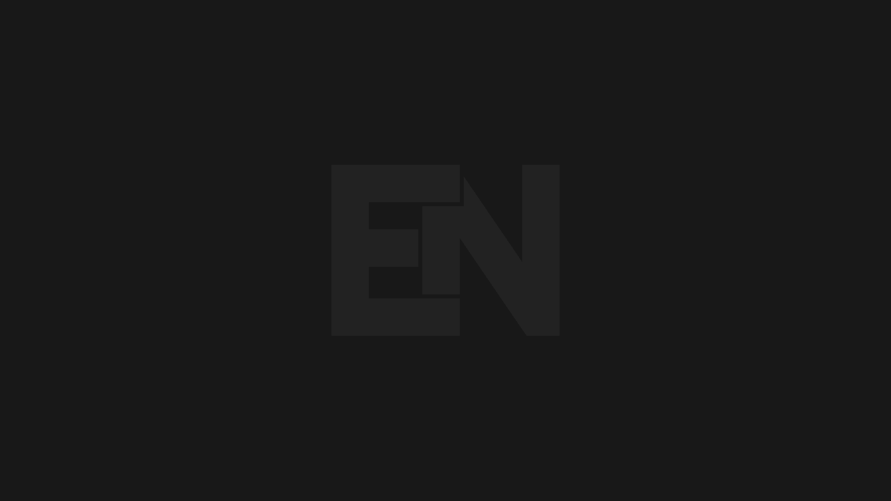 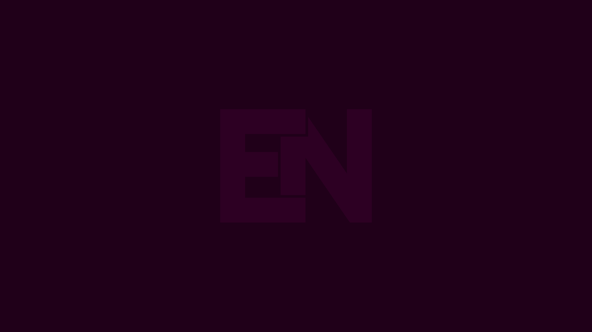 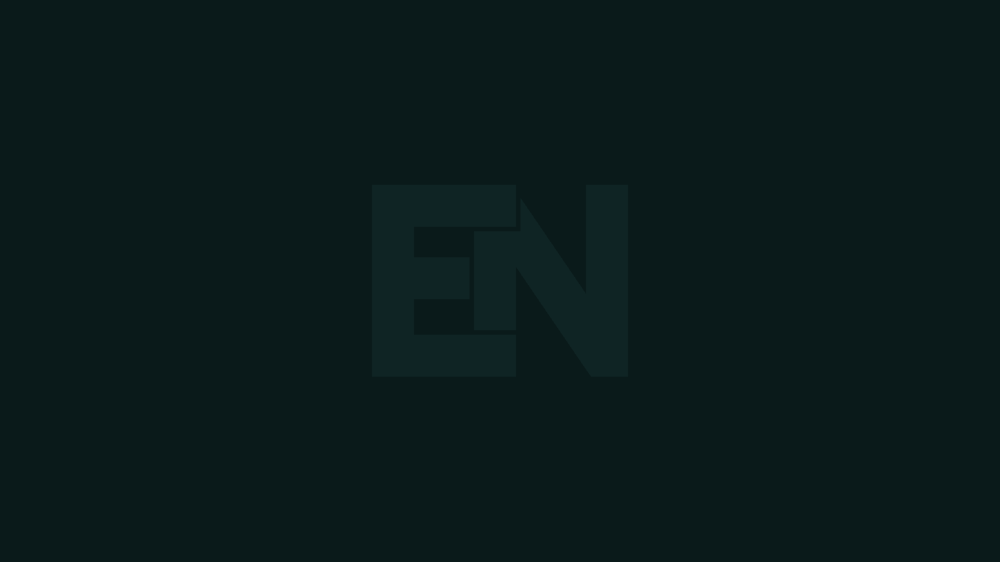
 
 
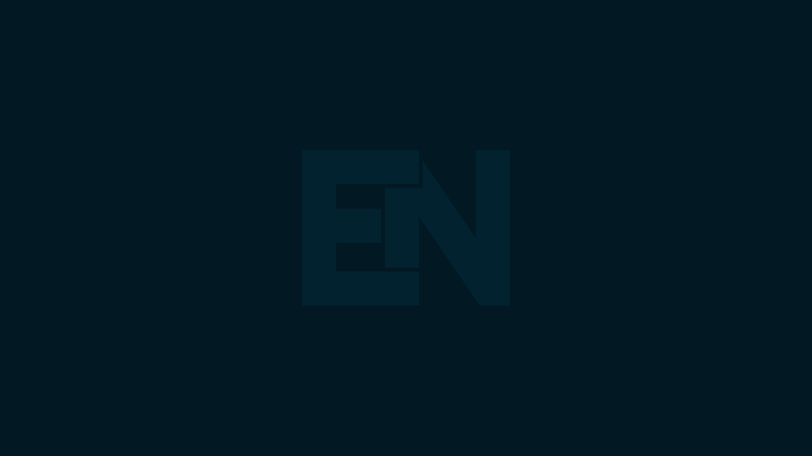 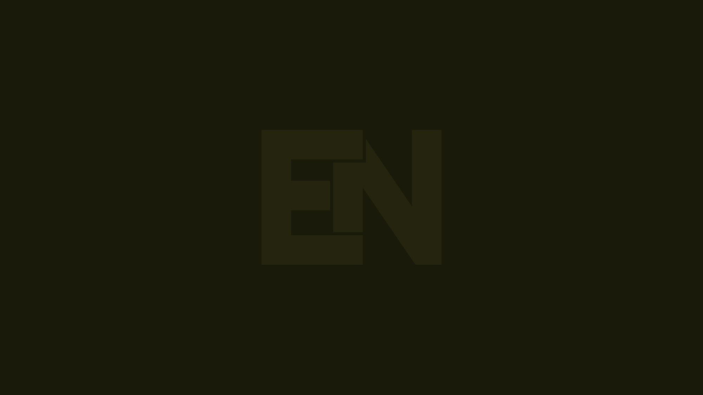 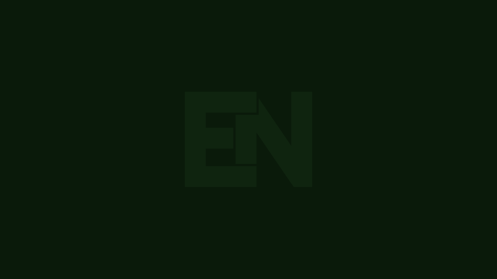
 
 
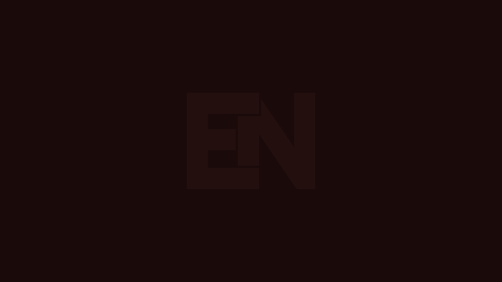 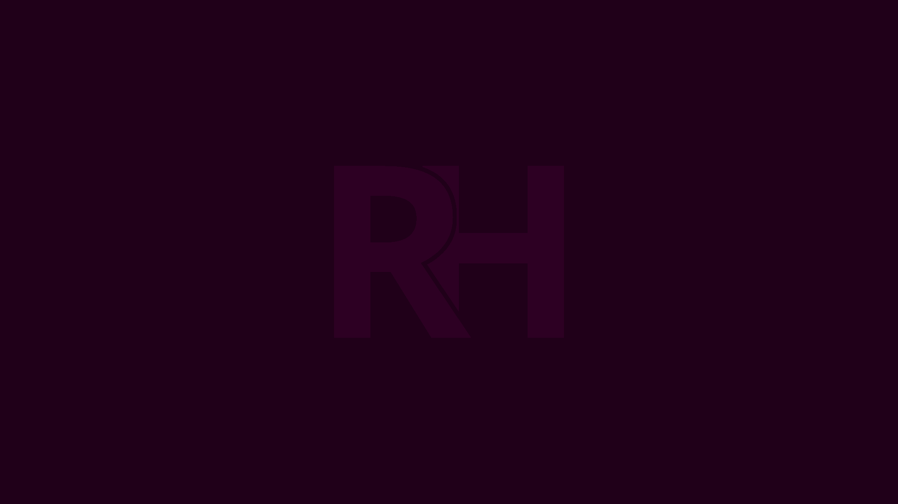 

## Website Favicons

 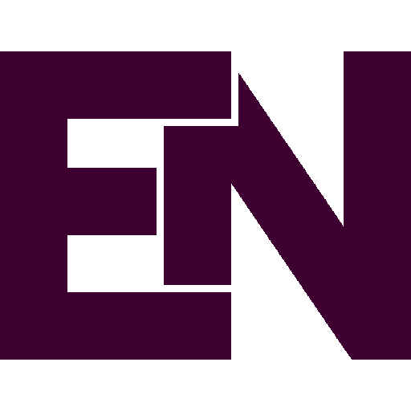 
 
 
  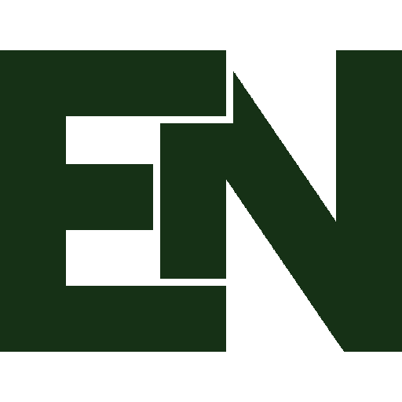
 
 
 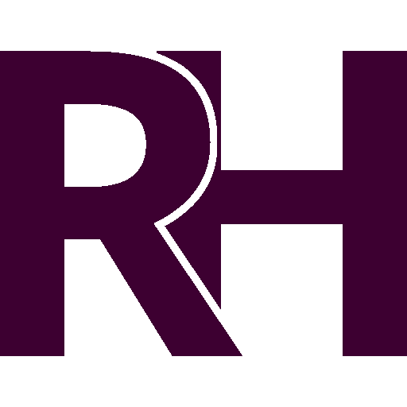 
