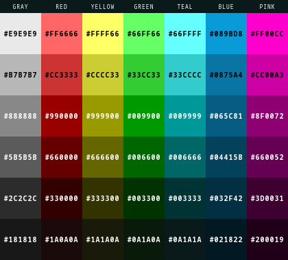
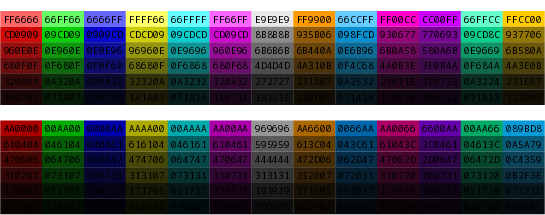
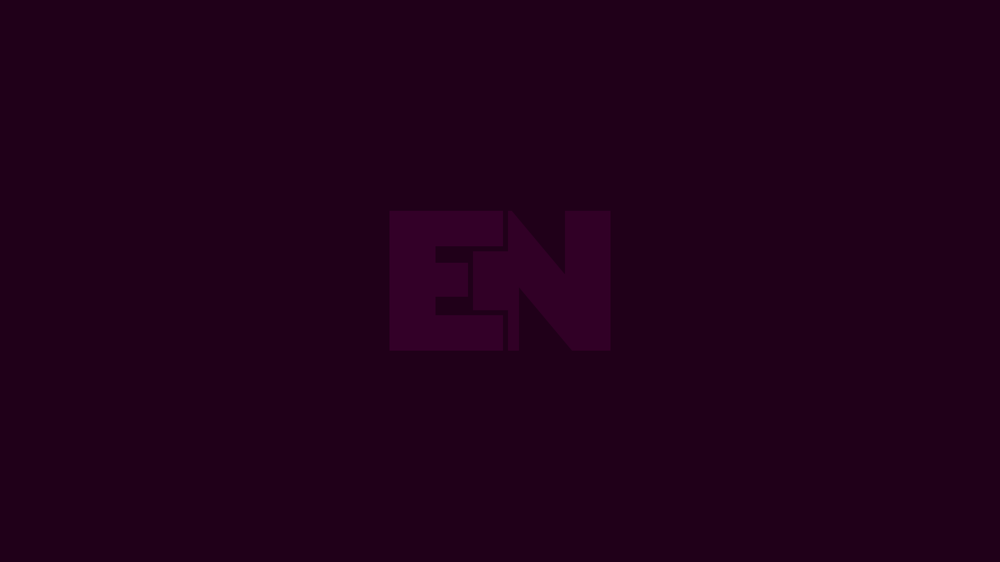
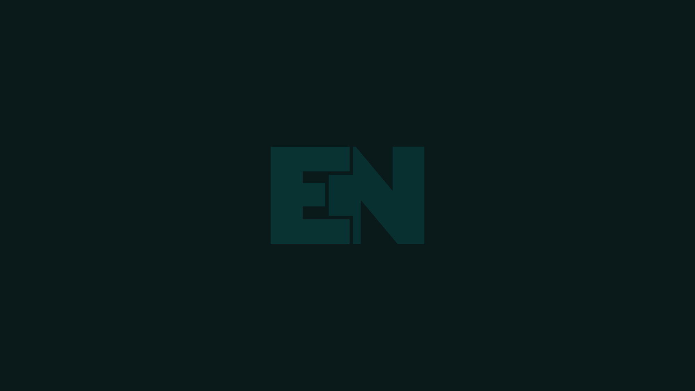
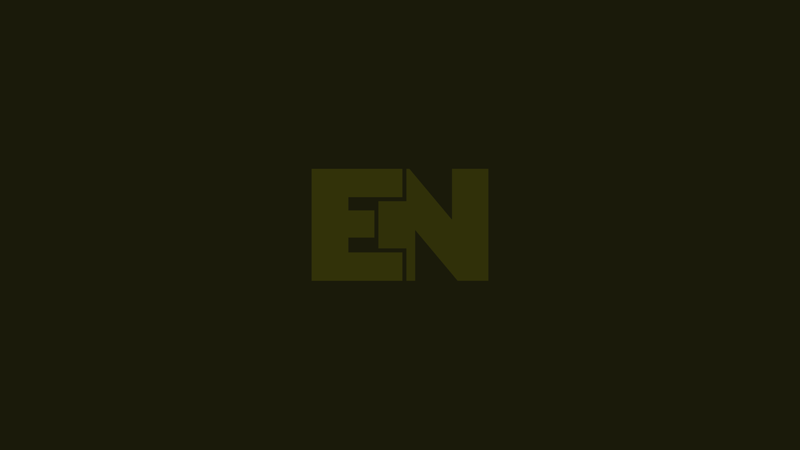
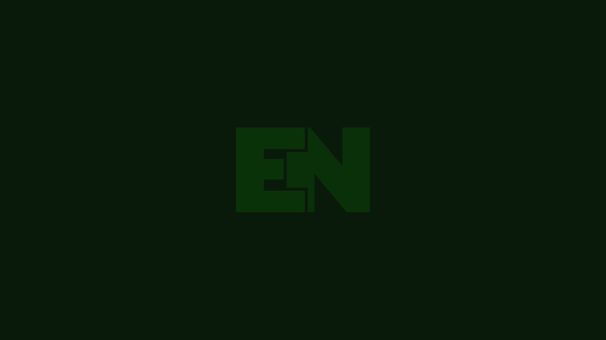

# Enasis Network Pixels

These are some images created for a myriad of purposes.

## Current Palette

## Future Palette

## Known uses of palette
Some projects are using these colors, and should be considered for updates.
It is possible that there are other items which are missing from this list.
- `enasisnetwork`:`encommon/encommon/webkit/styles/default.css`
- `enasisnetwork`:`websites/websites/static/styles/default.css`
- GitHub labels in various `enasisnetwork`/`rawberth` projects
- `enasisnetwork`:`sdmt-legacy-conf/inventory-prod/group_vars/robert_workstation/settings.yml`
- `enasisnetwork`:`sdmt-legacy-conf/role-provision/templates/xfce4/terminal.j2`
- `enasisnetwork`:`sdmt-legacy-conf/role-provision/templates/xfce4/terminalrc.j2`
- `rawberth`:`weazel/weazel/plugins/interact.py`
- Various `enasisnetwork`/`rawberth` projects using `makebadge.py`
- Icons in several places; example `robertharris`:`weazel/static`

## Icons
  
 
  
 
  

## Backgrounds
  
 
  
 
  
