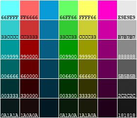
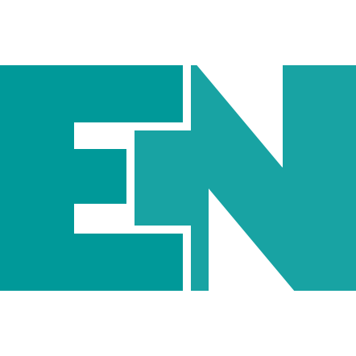
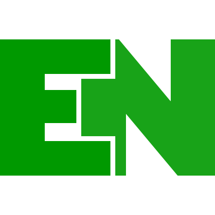
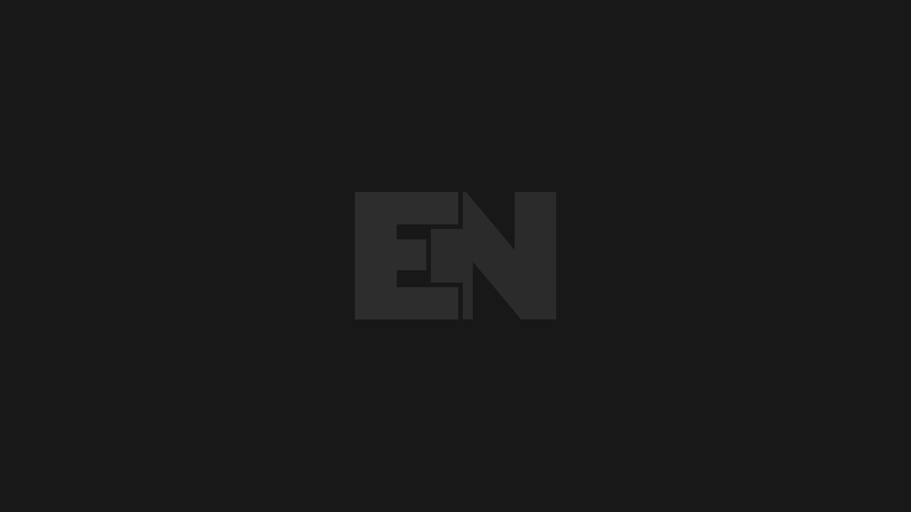
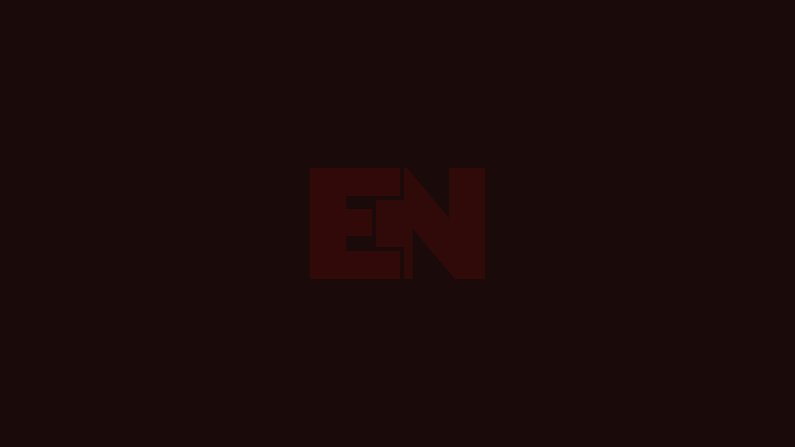
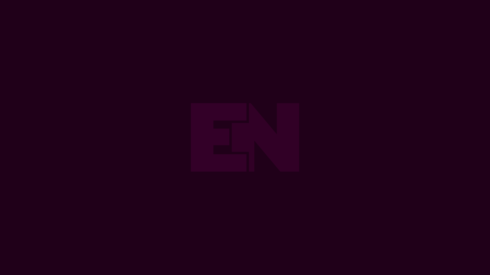
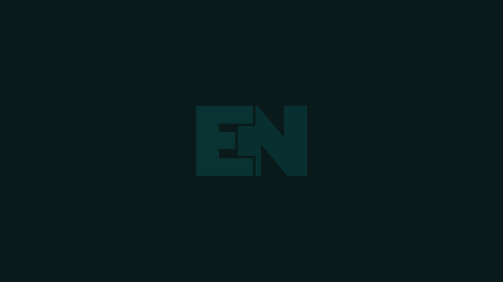
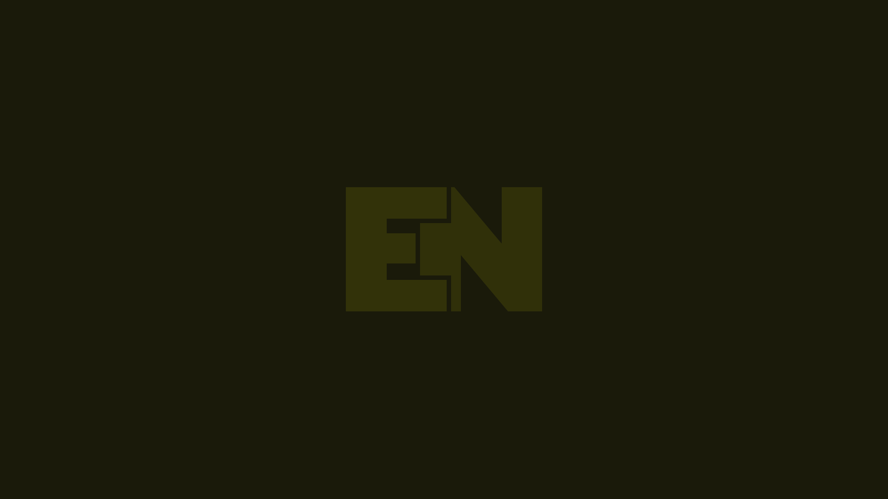
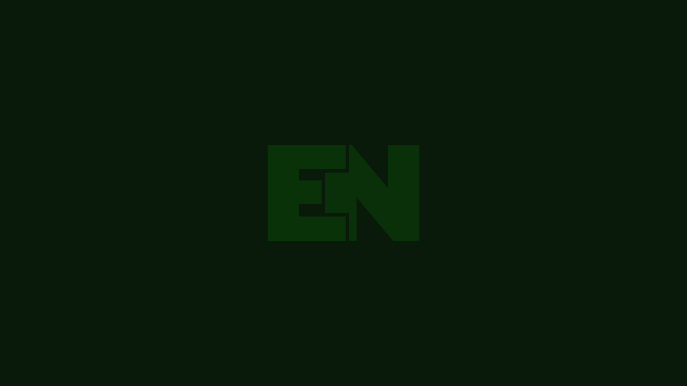
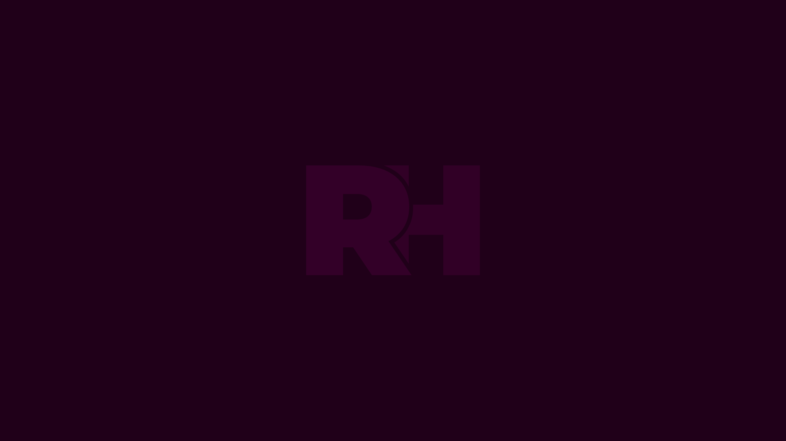

# Enasis Network Pixels

These are some images created for a myriad of purposes.

## Palette

 
 
New colors for blue and
pink are coming!

## Icons
  
 
  
 
  

## Backgrounds
  
 
  
 
  
